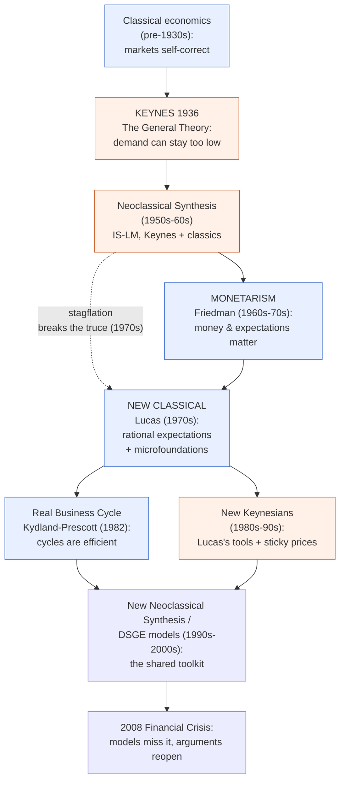

<a class="hom-back" href="{{ '/teachings/macroeconomics-i/#additional-readings' | relative_url }}">← Back to Macroeconomics-I</a>

Optional background for the "schools of thought" thread in ECON 202. It traces how macroeconomics grew from Keynes to the IS–LM / AS–AD toolkit you meet in class, and why economists still argue about the same handful of questions. Not for assessment. Read it to see how the models you are learning fit together.

## The whole story in one picture

Almost all of macroeconomics is one long argument that keeps splitting into two camps and then partly merging again. One camp trusts markets to heal themselves. The other thinks the government and the central bank sometimes have to step in. Read the map top to bottom as time, and notice that ideas get inherited, not thrown away.

Blue means "leave markets alone." Orange means "policy should help." No side ever fully won. Each generation borrowed the previous generation's tools and then disagreed about what they implied.

## What macroeconomics is trying to do

Microeconomics looks at one market at a time: one buyer, one firm, one price. Macroeconomics steps back and asks about the whole economy. Total output (GDP). Total employment and unemployment. The general rate at which prices rise (inflation). Interest rates and exchange rates. And one practical question that micro usually skips: what, if anything, should the government and the central bank do about all of it?

The core questions have barely changed in a century. Why do economies grow for years and then crash? Why is unemployment high in some periods and low in others? What causes inflation, and what does it cost to bring it down? Can policymakers actually make things better, or do they mostly make things worse? The questions stayed the same. The answers kept changing. That is the history of macro.

## Before there was macro: the classical world

Before the 1930s there was no separate subject called macroeconomics. Economists in the "classical" tradition mostly believed a market economy fixes itself. If workers were unemployed, that was because wages were temporarily too high. Wages would fall, firms would hire again, and the economy would return to full employment on its own. The idea was often summed up by Say's Law: production creates its own demand, so a general, lasting glut of unsold goods and idle workers was basically impossible. Downturns were short and self-healing. The policy advice was simple. Leave it alone.

## Keynes: demand can fail

Then came the event classical theory said could not last. The Great Depression of the 1930s pushed unemployment above 20% in some countries for years. Wages fell, and the jobs did not come back.

In 1936 John Maynard Keynes published *The General Theory of Employment, Interest and Money* with an explanation. An economy can get stuck in a slump because **aggregate demand**, the total spending by households, firms, and government, is simply too low. When people are scared they spend less. When firms see weak sales they invest less and lay people off. Those workers then spend even less. The economy can settle at a miserable equilibrium with high unemployment and just sit there.

Keynes's conclusion was radical for its time. The economy will not always fix itself, and the government can break the vicious circle by spending, whether on roads, jobs, or tax cuts, to replace the private demand that has gone missing. This gave governments a reason to manage the economy actively, and it created macroeconomics as its own field.

## Taming Keynes: the neoclassical synthesis and IS–LM

Keynes's book was powerful but sprawling and, in places, vague. Over the 1940s and 50s economists boiled it down into something teachable. John Hicks and Alvin Hansen built the **IS–LM model**, the two-curve diagram you will meet in class, which shows how the goods market (IS) and the money market (LM) together pin down output and the interest rate. Paul Samuelson then stitched Keynes to the older classical theory in what he called the **neoclassical synthesis**: in the short run, when prices and wages are sticky, Keynes is right and demand management works; in the long run, once prices adjust, the classical full-employment result returns.

For about two decades this synthesis was macroeconomics. It backed the confident, activist policy of the 1950s and 60s. Governments thought they could fine-tune the economy, buying a little less unemployment with a little more inflation along a relationship called the **Phillips curve**.

## Monetarism: money and expectations push back

Not everyone bought the activist consensus. At the University of Chicago, Milton Friedman led the **monetarist** counterattack, and it came in two waves.

First, he argued that "inflation is always and everywhere a monetary phenomenon." Sustained inflation comes from the central bank letting the money supply grow too fast, not from unions or greedy firms.

Second, and more damaging to the Keynesians, Friedman and Edmund Phelps argued in the late 1960s that the trade-off between inflation and unemployment was only temporary. A government could buy lower unemployment with surprise inflation, but only until workers caught on and demanded higher wages. Once expectations adjusted, unemployment went back to its **natural rate** and all that was left was higher inflation. The lesson: policymakers are not as clever as they think, and constant fine-tuning does more harm than good. Better to set steady, predictable rules and stick to them.

## Stagflation and the new classical revolution

Friedman's warning came true fast. In the 1970s the rich economies got **stagflation**: high unemployment and high inflation at the same time. The simple Phillips-curve view had treated that as nearly impossible. The Keynesian consensus lost its authority, and a new generation moved in.

Its leader was Robert Lucas. He pushed Friedman's point about expectations to its limit with **rational expectations**: people form their forecasts by looking ahead, using all the information they have, including how they expect the government to behave, instead of simply extrapolating from past inflation. If people see a policy coming, they adjust in advance, and the policy can lose its bite before it lands. That led to the famous **Lucas Critique**: you cannot predict the effect of a new policy from statistical patterns estimated under the old policy, because people's behaviour changes when the rules change.

Lucas's fix reshaped the whole field. Macro models now had to be built explicitly from the choices of individual households and firms, the **microfoundations** of macro, so that the deep parameters like tastes and technology stayed put even when policy changed. This new classical program changed both what macroeconomists concluded and how they were allowed to argue.

## The heirs split: real business cycles and new Keynesians

Lucas's methods won. His followers then split over what they meant.

One branch was **Real Business Cycle (RBC)** theory, launched by Finn Kydland and Edward Prescott in 1982. They took the new tools and reached a startling conclusion: business cycles are not failures to be fixed, they are the economy's efficient response to real shocks, above all shocks to productivity such as a new technology or an oil crisis. On this view recessions are optimal adjustments, and policy meant to smooth them is pointless at best and harmful at worst. It was the "leave it alone" instinct, rebuilt on Lucas's foundations.

The other branch was the **new Keynesians**, including Gregory Mankiw, Olivier Blanchard, and Michael Woodford. They accepted microfoundations and rational expectations, then used them to rescue the Keynesian conclusion. Their key move was to show, rigorously, why prices and wages might be sticky: menu costs (the small but real cost of changing a price), staggered wage contracts, imperfect competition. If prices do not adjust instantly, demand shortfalls cause real recessions and monetary policy has real traction. Same "step in" instinct, now written in the new classical language.

## The modern synthesis: DSGE and the great convergence

By the 1990s the two camps had, surprisingly, converged. The result was the **new neoclassical synthesis**, built into **Dynamic Stochastic General Equilibrium (DSGE)** models. A DSGE model takes RBC's rigorous, forward-looking structure and adds the new Keynesians' sticky prices and active role for monetary policy. Central banks around the world adopted these models to guide interest rates and inflation targeting. By the mid-2000s many macroeconomists talked about a settled consensus, even a "Great Moderation" of tamed business cycles.

## 2008 and the argument reopens

That confidence did not survive the **2008 Global Financial Crisis**, which the mainstream DSGE models mostly failed to see coming. Part of the reason is embarrassing in hindsight: most of them had no real banking or financial sector in them. The crisis set off a wave of criticism, a revival of interest in finance, debt, and instability, and a fresh hearing for older and dissenting traditions such as post-Keynesian, Minskyan, and behavioural macro. The century-old argument, markets versus policy, had reopened in a new form.

## The thread that ties it together

If you remember one thing, remember the pendulum. Every big episode is a swing on a single question: can a market economy be trusted to right itself, or does the state and the central bank have to help?

The "leave it alone" line runs classical → monetarism → new classical and RBC. The "step in" line runs Keynes → neoclassical synthesis → new Keynesians.

And here is what the diagram is really for. The two lines do not ignore each other. They feed each other. The new Keynesians only won their argument by adopting their opponents' tools, and DSGE is literally a marriage of the two. No side ever fully won, and modern macro is an uneasy, productive blend of both instincts.

## A reality check: the story is tidier than the truth

Everything above is what historians call the "standard narrative," the clean, revolution-by-revolution version in textbooks. It is a good scaffold for a beginner. But the people who study this history for a living warn that it is too tidy, in two ways.

First, it shrinks a huge collective effort down to a handful of famous theorists, mostly American and mostly male, and their big ideas. In reality the field was built just as much by the people who collected the data, invented the econometrics, wrote the computer code, and staffed the central banks.

Second, it makes progress look like a neat series of revolutions. The real change was often slow and messy, driven as much by new data, faster computers, and the needs of policy as by new theory.

That messier, truer account is the subject of the recent open-access book that prompted this reading list: Sergi, Cherrier, Saïdi, Garcia Duarte, Goutsmedt, Renault, and Acosta, *A History of Macroeconomics* (2026). Once the five acts feel familiar, that is the level-2 read.

## Timeline at a glance

| Period | School / moment | Core idea | Policy verdict |
| :-- | :-- | :-- | :-- |
| pre-1930s | Classical | Markets self-correct (Say's Law) | Leave it alone |
| 1936 | Keynes | Demand can stay too low | Government should spend |
| 1950s–60s | Neoclassical synthesis (IS–LM) | Keynes short-run, classics long-run | Fine-tune demand |
| 1960s–70s | Monetarism (Friedman) | Money causes inflation; expectations matter | Follow steady rules |
| 1970s–80s | New classical (Lucas) | Rational expectations + microfoundations | Policy is often neutral |
| 1982+ | Real Business Cycle | Cycles are efficient responses to shocks | Do not intervene |
| 1980s–90s | New Keynesian | Sticky prices, rigorous version | Policy still works |
| 1990s–2000s | DSGE / new synthesis | The combined toolkit | Inflation targeting |
| 2008+ | Post-crisis | Models missed the crash | Argument reopens |

## Five names to know

| Economist | Big idea | One line |
| :-- | :-- | :-- |
| Keynes | Demand matters | Government spending can pull an economy out of a slump |
| Friedman | Money matters | Too much money means inflation; do not over-manage the economy |
| Lucas | Expectations matter | People anticipate policy, so build models from individual choices |
| Kydland & Prescott | Shocks matter | Cycles can be the economy's efficient response to shocks |
| New Keynesians (Mankiw, Woodford) | Stickiness matters | Prices and wages adjust slowly, so policy still has a job |

## Where to read, watch, and listen next

**Encyclopedia entries (start here):** the EconLib *Concise Encyclopedia* entries on [Keynesian Economics](https://www.econlib.org/library/Enc/KeynesianEconomics.html), [Monetarism](https://www.econlib.org/library/Enc/Monetarism.html), [New Classical Macroeconomics](https://www.econlib.org/library/Enc/NewClassicalMacroeconomics.html), and [New Keynesian Economics](https://www.econlib.org/library/Enc/NewKeynesianEconomics.html); plus the [Wikipedia overview](https://en.wikipedia.org/wiki/History_of_macroeconomic_thought).

**Blogs by historians of macro:** Beatrice Cherrier's [The Undercover Historian](https://beatricecherrier.wordpress.com/), Aurélien Goutsmedt's [history-of-macroeconomics posts](https://aurelien-goutsmedt.com/tag/history-of-macroeconomics/), and the [INET blog](https://www.ineteconomics.org/perspectives/blog).

**Podcasts:** [Smith and Marx Walk Into a Bar](https://hetpodcast.libsyn.com/) for the history of economics, and [Macro Musings](https://www.mercatus.org/macro-musings) for modern policy debates.

**Go deeper:** Snowdon & Vane, *Modern Macroeconomics* (2005), which includes interviews with the economists themselves; De Vroey, *A History of Macroeconomics from Keynes to Lucas and Beyond* (2016); and the open-access Sergi et al., [*A History of Macroeconomics*](https://hal.science/hal-05720158) (2026).

Compiled for ECON 202 (Macroeconomics-I), FLAME University. Background reading only, not examinable. Suggestions and corrections are welcome by email.

