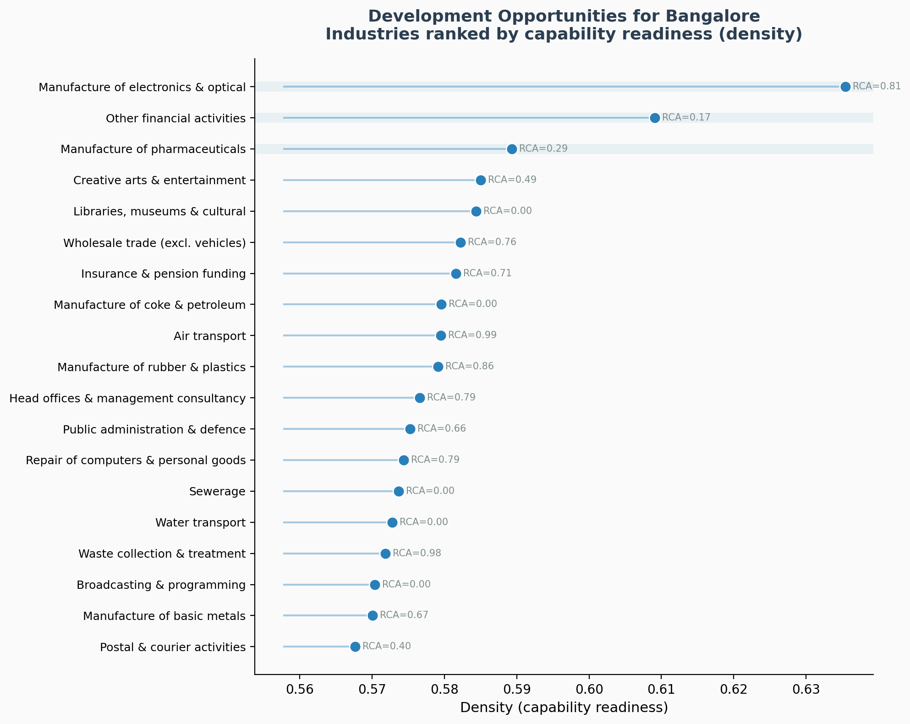
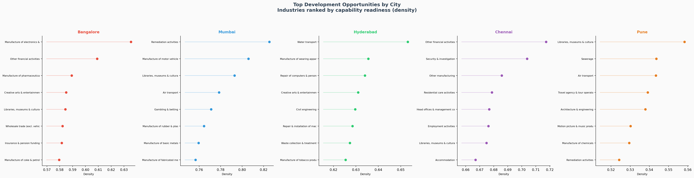
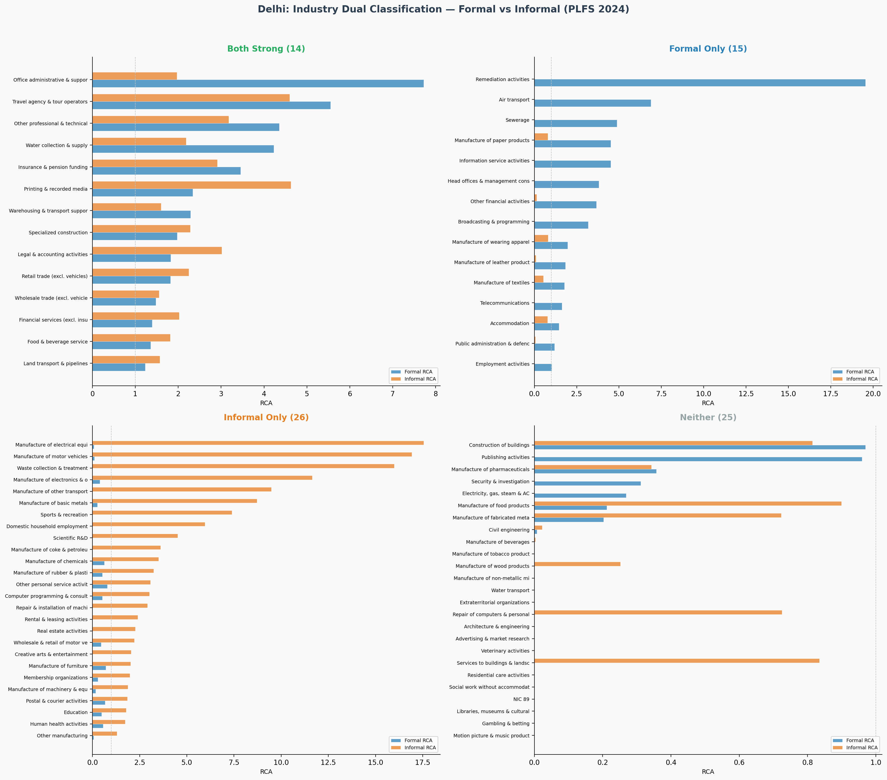
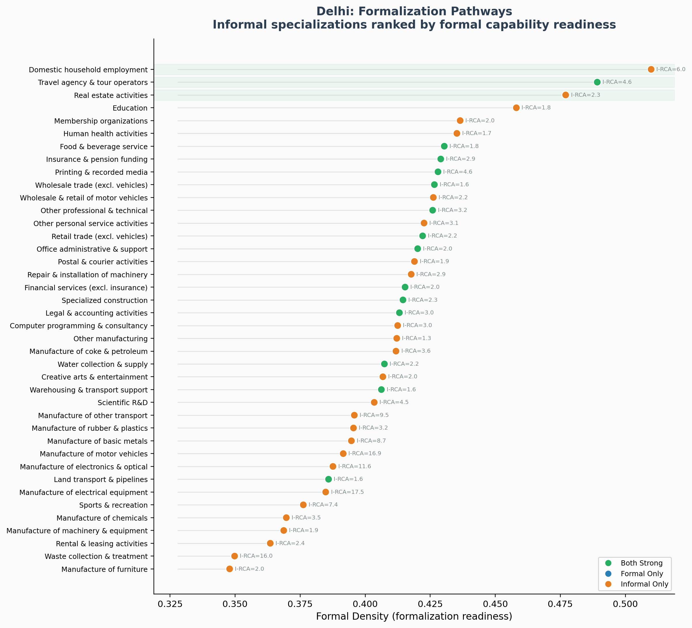
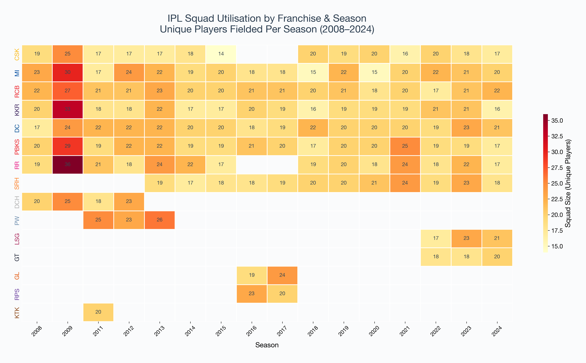

## Overview

This project applies the **economic complexity** framework --- originally developed by Hidalgo et al. (2007) and Hausmann & Hidalgo (2011) for cross-country product spaces --- to **Indian cities** at the subnational level, using micro-data from the Periodic Labour Force Survey (PLFS) 2024.

The analysis produces three contributions:

1. **Bangalore: Industry Space & Development Opportunities** --- Standard economic complexity mapping using co-location relatedness across Indian districts, identifying Bangalore's industrial strengths and highest-potential development opportunities.

2. **Five-City Comparison: Bangalore, Mumbai, Hyderabad, Chennai & Pune** --- Cross-city analysis of specialization patterns, diversification profiles, and development opportunities across India's major technology and industrial hubs.

3. **Delhi: Dual Formal--Informal Industry Space** --- A novel extension that builds *two parallel industry spaces* for formal and informal workers, revealing the dual structure of Delhi's economy and identifying **formalization pathways** --- informal specializations with the highest formal capability readiness.

---

## Part 1: Bangalore --- Industry Space & SWOT

### Methodology

For each 2-digit NIC industry in each Indian district, I compute:

- **Revealed Comparative Advantage (RCA):** Is industry $i$ overrepresented in city $c$ relative to all-India?

$$\text{RCA}_{c,i} = \frac{E_{c,i}/E_{c,\cdot}}{E_{\cdot,i}/E_{\cdot,\cdot}}$$

- **Co-location Proximity ($\varphi$):** How related are two industries, based on their tendency to co-locate across 744 Indian districts?

$$\varphi_{i,j} = \min\bigl(P(x_i=1 \mid x_j=1),\; P(x_j=1 \mid x_i=1)\bigr)$$

- **Density ($\omega$):** How many related industries does the city already have?

$$\omega_{c,i} = \frac{\sum_j \varphi_{i,j} \cdot x_{c,j}}{\sum_j \varphi_{i,j}}$$

Industries are then classified into a **SWOT framework** based on RCA (above/below 1) and Density (above/below median).

### Industry Space Network

The nodes represent 2-digit NIC industries; edges connect industries with co-location proximity $\varphi > 0.25$. Node size is proportional to RCA; colour indicates SWOT category.

### SWOT: RCA vs. Density

Each dot is an industry. The four quadrants represent Strengths (high RCA, high density), Weaknesses (high RCA, low density), Opportunities (low RCA, high density), and Threats (low RCA, low density).

### Key Findings

**Top Strengths** (RCA > 1, high density):

| Industry | RCA |
|----------|-----|
| Computer programming & consultancy | 17.7 |
| Other transport equipment (aerospace) | 11.5 |
| Travel agencies & tour operators | 8.1 |
| Information service activities | 7.3 |
| Real estate activities | 6.4 |
| Machinery & equipment manufacturing | 3.8 |

**Top Development Opportunities** (RCA < 1 but highest density):

**Electronics & optical products** emerges as the top opportunity --- Bangalore has RCA = 0.81 (nearly a specialization) with the highest density (0.635) of any industry, indicating strong capability readiness. Pharmaceuticals and financial services follow.

---

## Part 2: Five-City Comparison

### Cities Analysed

The economic complexity framework is extended to five major Indian cities, all computed from a single all-India proximity matrix (744 districts $\times$ 80 industries). Each city is identified as the largest urban employment district in its state:

| City | State | District | Specializations (RCA > 1) |
|------|-------|----------|---------------------------|
| Bangalore | Karnataka | 18 | 41 |
| Mumbai | Maharashtra | 22 | 57 |
| Hyderabad | Telangana | 23 | 45 |
| Chennai | Tamil Nadu | 02 | 48 |
| Pune | Maharashtra | 25 | 36 |

### City Complexity Profiles

The SWOT breakdown reveals distinct industrial characters. Mumbai has the broadest base (57 specializations, 32 strengths) while Pune and Bangalore have the most untapped opportunities (17 and 19, respectively), suggesting greater diversification potential.

### Cross-City RCA Heatmap

The heatmap shows which industries each city specializes in (RCA > 1, darker = stronger). **11 industries are shared across all five cities**, including computer programming, financial services, real estate, warehousing, and electrical equipment manufacturing --- revealing the common capabilities of India's major urban centres.

### SWOT Comparison: Five Panels

Each panel shows one city's RCA-vs-density scatter. The quadrant structure identifies Strengths (top-right), Opportunities (bottom-right), Weaknesses (top-left), and Threats (bottom-left).

### Industry Space Networks

The same force-directed layout is used across all five cities, enabling direct visual comparison of which parts of the industry space each city has activated.

### Key Patterns

**Unique specializations** (RCA > 1 in only one city):

| Industry | City | RCA |
|----------|------|-----|
| Remediation activities | Hyderabad | 33.3 |
| Rental & leasing | Chennai | 4.1 |

**Top specialization by city:**

| City | Top Industry | RCA |
|------|-------------|-----|
| Bangalore | Computer programming & consultancy | 17.7 |
| Mumbai | Motion picture & music production | 25.5 |
| Hyderabad | Remediation activities | 33.3 |
| Chennai | Motion picture & music production | 24.3 |
| Pune | Publishing activities | 20.4 |

### Development Opportunities

The opportunity comparison highlights each city's highest-density industries where RCA is currently below 1 --- the most promising targets for industrial diversification.

---

## Part 3: Delhi --- Dual Formal--Informal Complexity

### Motivation

Approximately 86% of Delhi's workforce is **informal**. Standard economic complexity analysis treats all workers identically, obscuring the dual structure of developing-country cities. This analysis builds *separate industry spaces* for formal and informal workers.

### Informality Classification

Following the hybrid NCEUS/ILO framework applied to PLFS 2024:

| Worker type | Classification | Rule |
|---|---|---|
| Casual workers (status 41, 51) | Informal | Always |
| Own-account, unpaid helper (11, 21) | Informal | Always |
| Regular wage, no social security | Informal | Social security code = 8 |
| Regular wage, has social security | Formal | Social security codes 1--7 |
| Employer, < 10 workers | Informal | Workers count codes 1--2 |
| Employer, $\geq$ 10 workers | Formal | Workers count codes 3--4 |

### Dual Industry Space

Two parallel industry spaces, using a shared network layout for visual comparison. The formal space (left) is sparser and concentrated in services; the informal space (right) is denser with strong manufacturing clusters.

### Formal vs. Informal RCA Comparison

The central visualization: each industry plotted by its informal RCA (x-axis) vs. formal RCA (y-axis). The diagonal represents equal specialization. Industries above the diagonal are formal-dominant; below are informal-dominant.

### Dual Classification

Industries fall into four categories based on where RCA exceeds 1:

| Category | Count | Examples |
|---|---|---|
| **Both Strong** | 14 | Office admin, travel, professional services, insurance, legal, retail |
| **Formal Only** | 15 | Air transport, remediation, sewerage, information services, telecoms |
| **Informal Only** | 26 | Electrical equipment (RCA=17.5), motor vehicles (16.9), waste collection (16.0), electronics (11.6) |
| **Neither** | 25 | Construction, pharmaceuticals, publishing |

### Formalization Pathways

The most policy-relevant output: among Delhi's informal specializations, which have the highest **formal density** --- i.e., the strongest surrounding formal capabilities that could support a transition?

The top formalization pathways are:

1. **Domestic household employment** --- highest formal density (0.51) with strong informal RCA (6.0)
2. **Travel agencies** --- already strong in both sectors, easiest transition
3. **Real estate** --- growing formal ecosystem supports informal workers
4. **Education** --- 56% informal share but established formal infrastructure
5. **Health activities** --- similar dual structure with 56% informality

---

## Data & Methods

+ **Data:** Periodic Labour Force Survey (PLFS) 2024, January--December, NSO, Government of India. 415,549 persons; 164,046 employed.
+ **Industry Classification:** 2-digit NIC 2008 divisions (80 industries)
+ **Geographic Units:** 744 districts (State $\times$ District from PLFS). Bangalore = Karnataka District 18, Mumbai = Maharashtra District 22, Hyderabad = Telangana District 23, Chennai = Tamil Nadu District 02, Pune = Maharashtra District 25, Delhi = all districts aggregated
+ **Proximity Measure:** Co-location relatedness across all Indian districts (Hidalgo et al. 2007)
+ **Informality Definition:** Hybrid NCEUS/ILO classification combining employment status, social security coverage, and enterprise size

---

## References

+ Hidalgo, C. A., Klinger, B., Barabasi, A. L., & Hausmann, R. (2007). The Product Space Conditions the Development of Nations. *Science*, 317(5837), 482--487.
+ Hausmann, R., & Hidalgo, C. A. (2011). *The Atlas of Economic Complexity.* MIT Press.
+ Neffke, F., Henning, M., & Boschma, R. (2011). How Do Regions Diversify over Time? Industry Relatedness and the Development of New Growth Paths in Regions. *Economic Geography*, 87(3), 237--265.
+ Balland, P. A., Boschma, R., Crespo, J., & Rigby, D. L. (2019). Smart Specialization Policy in the European Union: Relatedness, Knowledge Complexity and Regional Diversification. *Regional Studies*, 53(9), 1252--1268.
+ NCEUS (2004). *Report on Conditions of Work and Promotion of Livelihoods in the Unorganised Sector.* Government of India.
+ World Bank (2021). *The Long Shadow of Informality: Challenges and Policies.*

---

## Part 4: IPL Player Space --- Complexity Meets Cricket

Can the economic complexity framework map a cricket league? This extension applies the same co-location and relatedness methods to the **Indian Premier League (IPL)**, treating franchises as "countries" and players as "products." A bipartite Teams $\times$ Players network built from ball-by-ball data across 17 seasons (2008--2024) reveals how 724 players connect 15 franchises through shared rosters, team-switching, and co-occurrence. The resulting **Player Space** --- where edges link players who have been teammates, weighted by shared seasons --- surfaces clusters of franchise loyalty, player mobility ecosystems, and recruitment signatures distinct to each team.

### The Player Space Network

The hero visualisation: 149 of the most active IPL players, connected by co-occurrence on the same team. Node colour marks each player's primary franchise; node size reflects career length. The dense core shows high-mobility veterans who have represented multiple teams, while the periphery reveals franchise-loyal clusters --- the CSK (yellow) and MI (blue) groupings are particularly tight-knit.

### Franchise Similarity Network

Which franchises share the most players? Edge width is proportional to the number of players who have represented both teams. **RCB and DC share the most players (44)**, followed by DC--KKR (39). The defunct franchises (DCH, PW, KTK) sit at the periphery, while the eight core teams form a densely interconnected core --- evidence of a highly fluid player market.

### Player Journeys

A dot-strip chart tracking the top 20 most experienced IPL players across seasons. Each dot is coloured by team and labelled with the franchise abbreviation. Some players are strikingly loyal --- **MS Dhoni** (CSK, 16 seasons), **Virat Kohli** (RCB, 16 seasons), **Rohit Sharma** (MI, 16 seasons) --- while others like **Ajinkya Rahane** (6 franchises) and **Dinesh Karthik** (6 franchises) are quintessential journeymen whose mobility stitches the league together.

### Most Connected Players

Who has the most co-occurrence links? **David Warner** leads with 31 unique teammates in the network and the highest weighted co-occurrence strength, a product of long stints at both DC and SRH. Rohit Sharma, Ambati Rayudu, and MS Dhoni follow --- their long careers and franchise stability generate deep connectivity.

### Squad Utilisation Heatmap

Each cell shows the number of unique players a franchise fielded in a given season. The early years (2009 especially) saw larger squads --- RR used 36 players in 2009. Over time, squad utilisation has converged to 17--22 players per season. CSK and MI stand out for consistently lower numbers, suggesting greater roster stability.

### Franchise Loyalty Profile

For each core franchise, how many of their all-time players were **one-club players** (played for that franchise only), **two-franchise** players, or **three-plus franchise journeymen**? CSK has the smallest total roster (103 players) --- consistent with their reputation for squad stability. RCB and DC have the highest total (158 and 158), reflecting greater churn. Across all franchises, roughly a third of players are one-club, a third have played for two, and a third are journeymen.

---

## Code & Replication

The urban economic complexity analysis is implemented in Python using PLFS 2024 unit-level data. The IPL Player Space analysis uses ball-by-ball data from Kaggle (IPL 2008--2024, ODbL licence) covering 724 players across 15 franchises and 17 seasons. All code computes RCA, co-location proximity, density, and SWOT classification (Parts 1--3) or player co-occurrence networks and franchise connectivity (Part 4) from raw microdata. Interactive HTML versions are available upon request.
