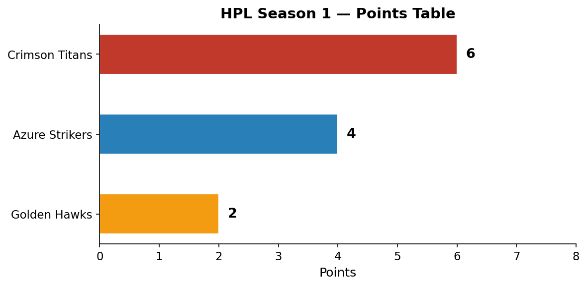
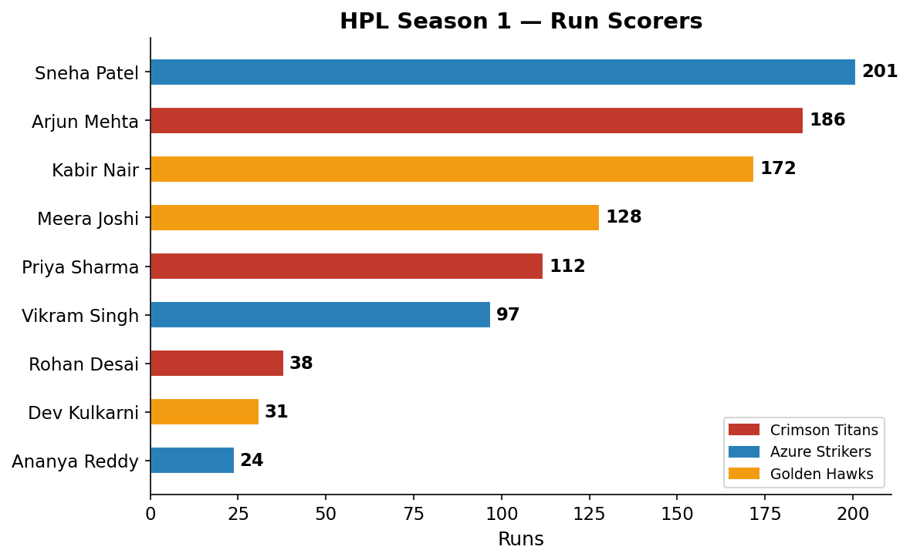
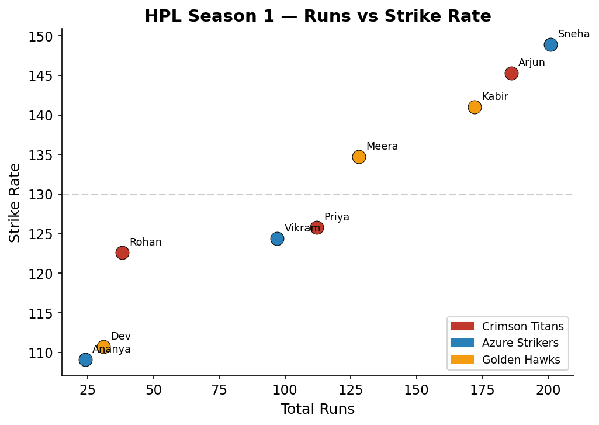
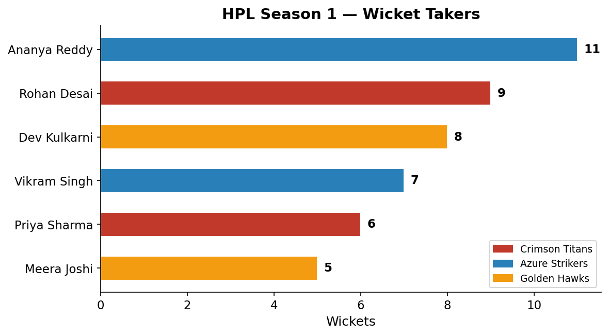
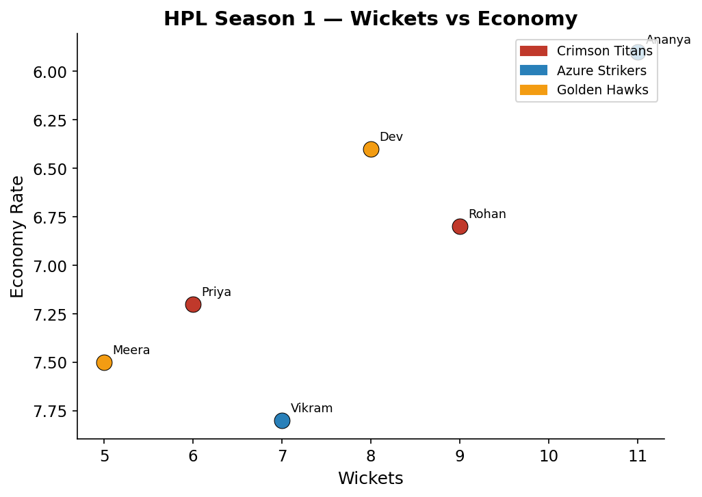
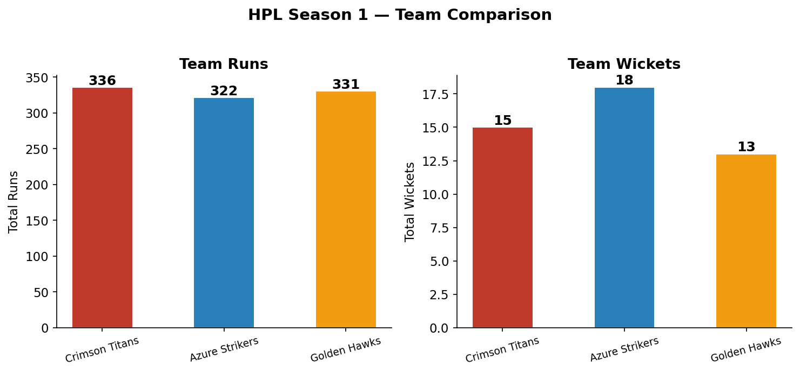

## The Format

The **House Premier League (HPL)** is a fast-format cricket tournament: **5 overs per innings, 3 players per team, 3 teams**. Every ball counts, every wicket is decisive, and there's nowhere to hide.

| Parameter | Value |
|-----------|-------|
| Overs per innings | 5 (30 balls) |
| Players per team | 3 |
| Teams | 3 |
| League matches | 6 (round-robin, home & away) |
| Final | Top 2 teams |
| Total matches | 7 |

---

## Teams & Squads

### Crimson Titans

| Player | Role | Batting Style | Bowling Style |
|--------|------|--------------|---------------|
| Arjun Mehta | Batsman | Right-hand | -- |
| Priya Sharma | All-rounder | Left-hand | Right-arm medium |
| Rohan Desai | Bowler | Right-hand | Left-arm spin |

### Azure Strikers

| Player | Role | Batting Style | Bowling Style |
|--------|------|--------------|---------------|
| Sneha Patel | Batsman | Right-hand | -- |
| Vikram Singh | All-rounder | Left-hand | Right-arm fast |
| Ananya Reddy | Bowler | Right-hand | Right-arm off-spin |

### Golden Hawks

| Player | Role | Batting Style | Bowling Style |
|--------|------|--------------|---------------|
| Kabir Nair | Batsman | Left-hand | -- |
| Meera Joshi | All-rounder | Right-hand | Left-arm spin |
| Dev Kulkarni | Bowler | Right-hand | Right-arm medium |

---

## Points Table

| Team | P | W | L | NRR | Pts |
|------|---|---|---|-----|-----|
| **Crimson Titans** | 4 | 3 | 1 | +0.84 | **6** |
| Azure Strikers | 4 | 2 | 2 | +0.21 | 4 |
| Golden Hawks | 4 | 1 | 3 | -1.05 | 2 |

**Crimson Titans** and **Azure Strikers** qualified for the Final.

---

## Match Results

| # | Match | Score | Result | MOTM |
|---|-------|-------|--------|------|
| 1 | CT vs AS | 58/2 — 54/3 | Crimson Titans won by 4 runs | Arjun Mehta (38 off 22) |
| 2 | AS vs GH | 62/1 — 59/3 | Azure Strikers won by 3 runs | Sneha Patel (42 off 26) |
| 3 | GH vs CT | 55/2 — 48/3 | Golden Hawks won by 7 runs | Meera Joshi (33* off 20) |
| 4 | AS vs CT | 49/3 — 51/1 | Crimson Titans won by 2 wkts | Rohan Desai (3/8) |
| 5 | GH vs AS | 61/2 — 63/1 | Azure Strikers won by 2 wkts | Ananya Reddy (3/11) |
| 6 | CT vs GH | 67/1 — 58/3 | Crimson Titans won by 9 runs | Arjun Mehta (48 off 28) |
| **F** | **CT vs AS** | **72/1 — 68/2** | **Crimson Titans won by 4 runs** | **Priya Sharma (34 off 19, 2/12)** |

**Champions: Crimson Titans**

---

## Batting Stats

| Player | Team | Runs | Balls | SR | HS | Avg | 4s | 6s |
|--------|------|------|-------|------|-----|------|----|----|
| Sneha Patel | Azure Strikers | 201 | 135 | 148.9 | 52 | 40.2 | 22 | 10 |
| Arjun Mehta | Crimson Titans | 186 | 128 | 145.3 | 48 | 37.2 | 18 | 9 |
| Kabir Nair | Golden Hawks | 172 | 122 | 141.0 | 45 | 34.4 | 16 | 8 |
| Meera Joshi | Golden Hawks | 128 | 95 | 134.7 | 41 | 25.6 | 12 | 6 |
| Priya Sharma | Crimson Titans | 112 | 89 | 125.8 | 34 | 22.4 | 10 | 4 |
| Vikram Singh | Azure Strikers | 97 | 78 | 124.4 | 29 | 19.4 | 8 | 3 |
| Rohan Desai | Crimson Titans | 38 | 31 | 122.6 | 18 | 12.7 | 3 | 2 |
| Dev Kulkarni | Golden Hawks | 31 | 28 | 110.7 | 15 | 10.3 | 2 | 1 |
| Ananya Reddy | Azure Strikers | 24 | 22 | 109.1 | 12 | 8.0 | 2 | 1 |

**Orange Cap: Sneha Patel (201 runs, SR 148.9)**

---

## Bowling Stats

| Player | Team | Wkts | Econ | Best |
|--------|------|------|------|------|
| Ananya Reddy | Azure Strikers | 11 | 5.9 | 3/11 |
| Rohan Desai | Crimson Titans | 9 | 6.8 | 3/8 |
| Dev Kulkarni | Golden Hawks | 8 | 6.4 | 2/9 |
| Vikram Singh | Azure Strikers | 7 | 7.8 | 2/14 |
| Priya Sharma | Crimson Titans | 6 | 7.2 | 2/12 |
| Meera Joshi | Golden Hawks | 5 | 7.5 | 2/10 |

**Purple Cap: Ananya Reddy (11 wickets, Econ 5.9)**

---

## Team Comparison

| Team | Total Runs | Total Wickets | Avg SR | Avg Econ |
|------|-----------|---------------|--------|----------|
| Crimson Titans | 336 | 15 | 131.2 | 7.0 |
| Azure Strikers | 322 | 18 | 127.5 | 6.9 |
| Golden Hawks | 331 | 13 | 128.8 | 7.0 |

---

## Awards

| Award | Player | Team |
|-------|--------|------|
| Orange Cap (Most Runs) | Sneha Patel (201) | Azure Strikers |
| Purple Cap (Most Wickets) | Ananya Reddy (11) | Azure Strikers |
| Player of the Tournament | Arjun Mehta | Crimson Titans |
| Best All-rounder | Meera Joshi | Golden Hawks |
| Best Catch | Vikram Singh | Azure Strikers |
| Finals MVP | Priya Sharma | Crimson Titans |

---

*HPL Season 1 · 2026*
